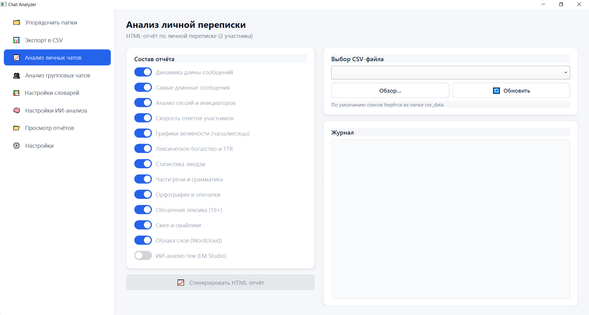

# Chat Analyzer
Приложение для анализа экспортированных переписок из ВКонтакте и Telegram. Превращает CSV-выгрузки сообщений в подробные HTML-отчёты с графиками, облаками слов, лингвистическим анализом и ИИ-разметкой тем.

---



---

## Основные возможности
### Aнализ личных чатов (2 участника)
* Динамика средней длины сообщений
* Топ самых длинных сообщений
* Анализ сессий и инициаторов диалогов
* Скорость ответов участников (среднее, медиана, самый быстрый/медленный ответ)
* Графики активности по часам и месяцам
* Лексическое богатство (Vocabulary & TTR) с динамикой
* Статистика эмодзи
* Лингвистический портрет (части речи через pymorphy3, грамматические признаки)
* Орфография и опечатки
* Анализ нецензурной лексики (18+)
* Смех и смайлики
* Облака слов (общее и по каждому участнику)

### Анализ групповых чатов (3+ участников)
* Средняя суточная активность
* Автомасштабируемый график активности
* Топ-15 активных участников
* Топ-10 длинных сообщений
* Самый долгий перерыв с контекстом диалога
* Топ слов и карта слов
* Эмодзи и нецензурная лексика
* Облако слов

### ИИ-анализ (опционально)
* Разметка личных диалогов по темам и сентименту через локальный сервер LM Studio
* Графики распределения тем и характера общения

## Интерфейс
Десктопное приложение на PySide6 со светлой темой и боковым меню:
* Упорядочивание папок
* Экспорт в CSV 
* Анализ личных чатов
* Анализ групповых чатов
* Настройки словарей (стоп-слова, белый список ошибок, чёрный список мата)
* Настройки ИИ-анализа
* Просмотр готовых отчётов
* Управление кэшем

---

# Установка
```bash
# 1. Клонируем репозиторий и переходим в папку проекта
git https://github.com/AdmiralXMystery/ChatAnalyzer.git
cd ChatAnalyzer

# 2. Создаём виртуальное окружение
python -m venv .venv

# 3. Активируем виртуальное окружение
.venv\Scripts\activate         # Windows (cmd / PowerShell)
source .venv/bin/activate      # Linux / macOS

# 4. Устанавливаем зависимости
pip install -r requirements.txt
```

---

# Запуск
```bash
python main.py
```

---

## 📂 Структура проекта

```text
chat-analyzer/
│
├── main.py                                       # Точка входа, светлая тема (QSS), запуск QApplication
├── requirements.txt                              # Зависимости проекта
├── analytical-chatting.ico                       # Иконка приложения (используется при сборке Nuitka)
├── settings.json                                 # Пользовательские словари и настройки LLM (создаётся при первом запуске)
├── README.md
│
├── core/                                         # Логика анализа, экспорта и генерации отчётов
│   ├── __init__.py
│   │
│   ├── chat_analyzer.py                          # Анализатор ЛИЧНЫХ чатов (2 участника)
│   │                                             #  ├─ объёмы, инициаторы, сессии, скорость ответов
│   │                                             #  ├─ TTR, топ-слов, эмодзи, части речи, грамматика
│   │                                             #  ├─ орфография, мат, смех, облака слов
│   │                                             #  └─ LLM-разметка тем и сентимента (LM Studio)
│   ├── chat_analyzer_group.py                    # Анализатор ГРУППОВЫХ чатов (3+ участников)
│   │                                             #  ├─ объёмы, суточная активность, timeline с автомасштабом
│   │                                             #  ├─ топ-длинные, самый долгий перерыв, карта слов
│   │                                             #  └─ эмодзи, мат (общая статистика)
│   │
│   ├── chat_report_generator.py                  # Генерация HTML-отчёта по личному чату
│   │                                             #  └─ графики: msg_length, hourly, monthly, TTR,
│   │                                             #     POS, grammar, errors, profanity, LLM-темы
│   ├── chat_report_generator_group.py            # Генерация HTML-отчёта по групповому чату
│   │                                             #  └─ графики: activity, top_senders, wordcloud
│   │
│   ├── csv_exporter.py                           # Парсер HTML-архивов ВКонтакте → CSV
│   ├── csv_exporter_tg_json.py                   # Парсер JSON-экспорта Telegram → CSV
│   ├── folder_processor.py                       # Упорядочивание папок VK-архива (переименование/копирование)
│   │
│   ├── settings_manager.py                       # Словари (стоп-слова, whitelist ошибок, blacklist мата)
│   │                                             #  └─ промпт и списки тем/сентиментов для LLM
│   └── utils.py                                  # Утилиты: parse_message, parse_date, clean_folder_name
│
├── ui/                                           # Интерфейс на PySide6
│   ├── __init__.py
│   ├── main_window.py                            # Главное окно с сайдбаром и QStackedWidget
│   ├── widgets.py                                # Общие виджеты: Card, PageHeader, RunPanel,
│   │                                             #  ToggleSwitch, LimitedComboBox, LogWidget
│   ├── page_organizer.py                         # 🗂  Упорядочить папки
│   ├── page_csv.py                               # 📊  Экспорт в CSV
│   ├── page_analyzer.py                          # 📈  Анализ личных чатов
│   ├── page_group_analyzer.py                    # 👥  Анализ групповых чатов
│   ├── page_settings_dict.py                     # 📚  Настройки словарей
│   ├── page_settings_llm.py                      # 🧠  Настройки ИИ-анализа
│   ├── page_viewer.py                            # 📁  Просмотр отчётов
│   └── page_settings.py                          # ⚙️  Управление кэшем / настройки
│
├── templates/                                    # Jinja2-шаблоны HTML-отчётов
│   ├── report_template.html                      # Шаблон личного отчёта
│   └── group_report_template.html                # Шаблон группового отчёта
│
├── resources/                                    # Ресурсы для сборки/рантайма
│   └── ru.json.gz                                # Словарь русского языка для pyspellchecker
│
├── csv_data/                                     # Входные CSV-выгрузки переписок
│   ├── messages_<id>_vk.csv                      # Результат экспорта из VK (HTML)
│   └── <chat_name>_tg.csv                        # Результат экспорта из Telegram (JSON)
│
└── cache/                                        # Сгенерированные отчёты и графики
    ├── private_<имя_чата>/                       # Личные чаты (2 участника)
    │   ├── report.html
    │   ├── chart_hourly.png
    │   ├── chart_monthly.png
    │   ├── msg_length_dynamics.png
    │   ├── ttr_dynamics.png
    │   ├── pos_distribution.png
    │   ├── grammar_<sender>.png
    │   ├── error_dynamics.png
    │   ├── profanity_dynamics.png
    │   ├── wordcloud_overall.png
    │   ├── wordcloud_<sender>.png
    │   ├── chart_topics.png                      # (если включён ИИ-анализ)
    │   └── chart_sentiment.png                   # (если включён ИИ-анализ)
    └── group_<имя_чата>/                         # Групповые чаты (3+ участников)
        ├── report.html
        ├── chart_activity.png
        ├── chart_top_senders.png
        └── wordcloud_overall.png
```

---

## Формат входных данных
CSV-файл с колонками минимум:

* date — дата и время сообщения
* sender — отправитель
* text — текст сообщения

Файлы складываются в папку csv_data/ или выбираются вручную через кнопку «Обзор…».

---

# Результат
Все артефакты анализа (HTML-отчёт, PNG-графики, облака слов) сохраняются в изолированную папку:
* личный чат → cache/private_<имя_чата>/
* групповой чат → cache/group_<имя_чата>/

Открыть готовый отчёт можно прямо в приложении через раздел «Просмотр отчётов».

---

## Настройка ИИ-анализа
1. Установите LM Studio и загрузите любую instruct-модель.
2. Запустите локальный сервер (по умолчанию http://localhost:1234).
3. В приложении включите чекбокс «ИИ-анализ тем (LM Studio)» на странице анализа. 

Если сервер не запущен — математическая часть отчёта всё равно сформируется.

---

## Сборка в EXE (Nuitka)
Проект уже настроен для сборки (см. директивы в начале main.py):
`python -m nuitka main.py`

Будут автоматически подключены плагины PySide6 и matplotlib, включены пакеты core, ui, словари pymorphy3 и ресурсы.

---

## Лицензия
MIT

---

### Автор: AdmiralXMystery
### Если проект оказался полезным — поставьте ⭐ на GitHub!
